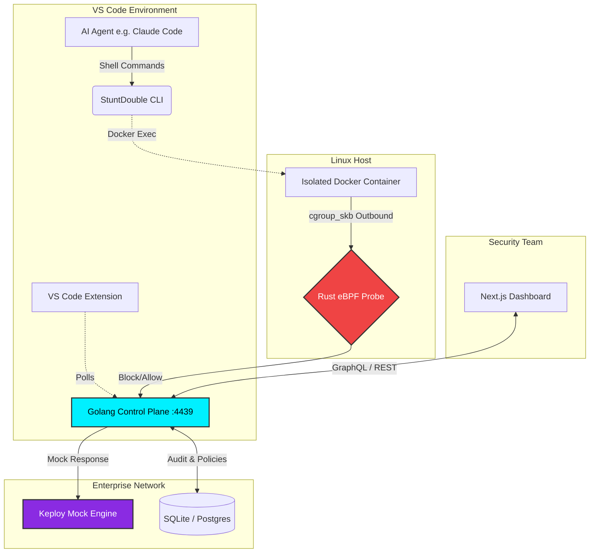

# 🏗️ StuntDouble Architecture

StuntDouble is designed to intercept and monitor AI agent actions at the lowest possible level (the kernel) while providing a high-level, human-readable SOC dashboard for the security team.

### Components
1. **VS Code Extension & CLI**: Wraps the AI agent and forces it to run inside a Docker container.
2. **Rust eBPF Probe**: Sits in the Linux kernel and intercepts `cgroup_skb` network packets before they leave the container.
3. **Golang Control Plane**: A centralized proxy that receives telemetry from the eBPF probe, enforces JSON policies, and writes to an SQLite audit database.
4. **Keploy Mock Engine**: Injects ghost responses for blocked APIs so agents don't crash.
5. **Next.js Dashboard**: A React frontend for the CTO to view live analytics and block logs.
