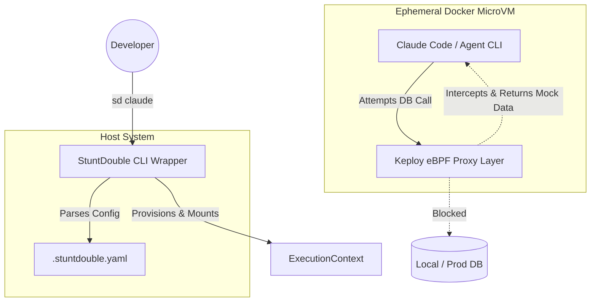
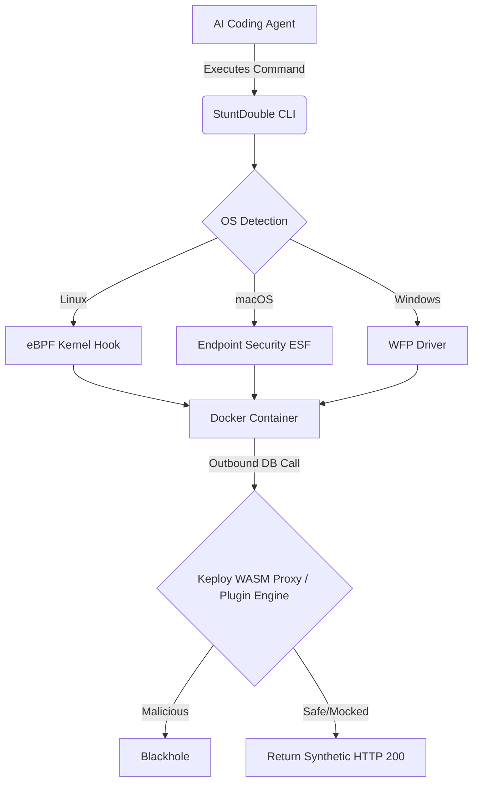

# 🏗 Architecture & System Design

StuntDouble acts as an orchestration middleware between the local host system, the container runtime, and the AI agent's standard I/O.

## High-Level Component Diagram

## Cross-Platform Kernel Interception

StuntDouble uses a multi-layered defense-in-depth approach, combining Docker namespace isolation with native kernel-level packet interception across Linux, macOS, and Windows.

## Core Components

### 1. The CLI Wrapper (`cmd/sd`)
Written in Go (for portability) or Node.js. It acts as the primary entry point. 
* Parses `.stuntdouble.yaml`.
* Verifies Docker daemon status.
* Drops Linux root capabilities (`--cap-drop=ALL`).
* Mounts the current working directory safely.

### 2. The Execution Engine
Instead of relying on the host OS sandboxing (like Apple's `Seatbelt`), StuntDouble enforces containerization. It builds an ephemeral, headless Alpine/Ubuntu container matching the host's requirements, drops the agent inside, and pipes `stdin/stdout` directly to the host terminal to ensure perfect UX.

### 3. The Stunt Layer (Mocks & Network)
Powered by Keploy (or a similar eBPF-based proxy). 
* When the container spins up, StuntDouble injects a proxy sidecar.
* It hooks into the container's network namespace.
* If an agent executes `psql -c "DROP TABLE users"`, the eBPF layer intercepts the port 5432 request, matches it against recorded mock schemas, and returns a synthetic `DROP TABLE` success response without touching the real network interface.

## Security Model
* **Filesystem:** Only the current working directory is mounted. Global SSH/AWS keys (`~/.ssh`) are completely inaccessible.
* **Network:** Default-deny egress policy for known database ports.
* **Compute:** Hard CPU and memory limits set via Docker to prevent agent runaway loops.
