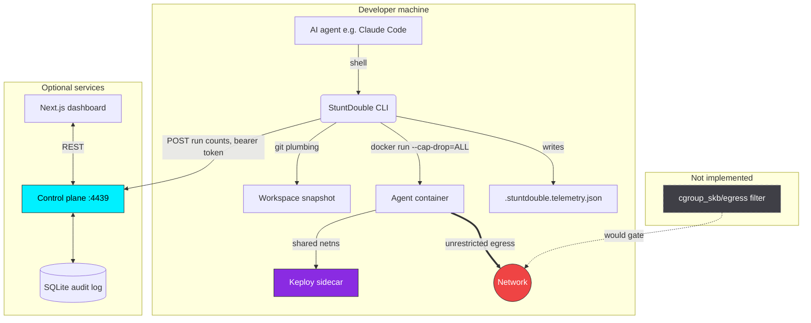

# 🏗️ StuntDouble Architecture

StuntDouble wraps an AI coding agent in a restricted container, snapshots the workspace so
its changes can be reverted, and reports run telemetry to an optional control plane.

This document describes the system as it is built. Components that exist but do not work
are labelled. See [docs/ENFORCEMENT.md](./docs/ENFORCEMENT.md) for the security boundary.

```mermaid
graph TD
    subgraph "Developer machine"
        A[AI agent e.g. Claude Code] -->|shell| B(StuntDouble CLI)
        B -->|git plumbing| S[Workspace snapshot]
        B -->|docker run --cap-drop=ALL| F[Agent container]
        F -->|shared netns| K[Keploy sidecar]
        F ==>|unrestricted egress| NET((Network))
        B -->|writes| T[.stuntdouble.telemetry.json]
    end

    subgraph "Not implemented"
        X[cgroup_skb/egress filter]
        X -.->|would gate| NET
    end

    subgraph "Optional services"
        B -->|POST run counts, bearer token| C[Control plane :4439]
        C <--> DB[(SQLite audit log)]
        D[Next.js dashboard] <-->|REST| C
    end

    style X fill:#3f3f46,stroke:#a1a1aa,stroke-dasharray: 5 5,color:#fff
    style NET fill:#ef4444,stroke:#333,color:#fff
    style C fill:#00f0ff,stroke:#333,color:#000
    style K fill:#8a2be2,stroke:#333,color:#fff
```

The red edge is the point of the diagram: agent traffic reaches the network directly. The
dashed box is the component that was supposed to gate it.

## Components

### 1. CLI (`cli/`) — working

The core of the project.

- `sd run <agent>` — pulls the runtime image, starts a Keploy sidecar, snapshots the
  workspace, and runs the agent with `--cap-drop=ALL`, `--memory=2g`, `--cpus=1.0` and the
  working directory mounted at `/workspace`. Calls `ebpf.AttachInterceptor` first and
  **refuses to run** unless `--allow-unenforced-network` acknowledges that it failed.
- `sd rewind` — restores the workspace from the snapshot (`git restore` + `git clean -fd`).
- `sd record <cmd>` — runs the command under Keploy to capture mocks. Privileged container.
- `sd stats` / `sd monitor` — local run counts; `monitor` polls the control plane.
- `sd serve` — serves local telemetry on loopback for the dashboard.
- `sd init`, `sd ci` — config and workflow scaffolding.

### 2. Egress filter (`cli/pkg/ebpf/`) — **not implemented**

`AttachInterceptor` returns `ErrUnsupported` on Linux, macOS and Windows. There is no
loaded BPF program, no ESF extension and no WFP driver.

`bpf_prog.c` contains a plausible `cgroup_skb/egress` program that looks up the destination
port in a BPF hash map and drops matches. It is marked `// +build ignore` and nothing
invokes `bpf2go`, so it is never compiled. Wiring it up requires: generating bindings with
clang, loading the objects, attaching to the container's cgroup, populating `blocked_ports`
from policy, and reading back drop counts.

`core-ebpf/` is a Rust placeholder that exits with an error rather than idling, so nothing
supervising it mistakes it for a running enforcement engine.

### 3. Control plane (`control-plane/`) — working, telemetry only

Go service on `127.0.0.1:4439`. Requires a bearer token (`STUNTDOUBLE_TOKEN`) on every
endpoint except `/api/health`, and refuses to start without one. CORS is restricted to a
single configured origin.

It aggregates run counts, stores an audit log in SQLite, and serves the policy document
over REST and GraphQL. It **distributes** policy; it does not enforce it. Audit records are
self-reported by clients.

### 4. Keploy integration — working, opt-in

A Keploy sidecar shares its network namespace with the agent container so Keploy can
capture traffic. `sd record` drives capture. `/api/keploy/mock` returns a canned success
payload to a caller routed to it.

Transparent interception — silently answering a blocked connection with a mock — depends on
the egress filter and therefore does not happen.

### 5. Dashboard (`dashboard/`, `docs/`) — working

Next.js client that polls the control plane with a bearer token. All figures come from API
responses; unavailable values render as `—`. The target breakdown is computed from real
audit rows.

### 6. Deployment tooling — early, unproven

`charts/` (Helm), `k8s-operator/`, `terraform-provider-stuntdouble/`. The Helm chart's
DaemonSet requests `privileged`, `hostPID`, `hostNetwork` and a `docker.sock` hostPath
mount — permissions that were intended for the eBPF engine that does not exist. **Do not
deploy it as-is**; those grants are equivalent to root on every node.

### 7. Exploratory, nothing shipped

`mac/`, `windows/`, `stuntos/`, `wasm/`, `stuntbot/`, `desktop-app/`, `python-sdk/`,
`vscode-extension/`.

## Trust model

The agent container is the untrusted component, but the boundary is porous:

- it holds forwarded `ANTHROPIC_API_KEY` / `OPENAI_API_KEY`
- it has unrestricted network access
- it has read/write access to the mounted workspace

So StuntDouble raises the cost of accidental damage — a confused agent deleting files, or
running away with CPU — and gives you a rollback. It is not a containment boundary against
a deliberately hostile agent.
